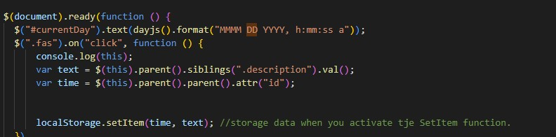
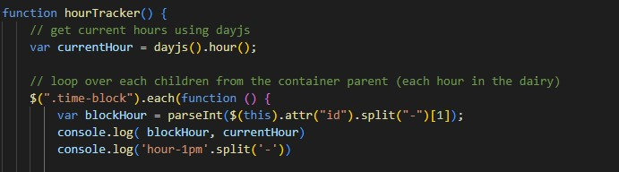
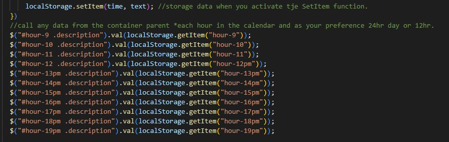
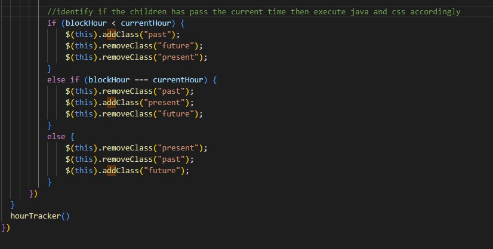

# **Day-By-Day-Scheduler**


## Instructions
 
After setting up a new repository in GitHub, please follow the steps below;

in **Current time and date**,
1. Calling dayjs() without parameters returns a fresh Day.js object with the current date and time.
 

 


in **Children elements**,


2. The localStorage object allows you to save key/value pairs in the browser using the following syntax:

Window.localStorage or localStorage; this information is display in the console and the user will be able to see by commanding console.log (). Assig an unique id in the html file to linked the stored information to html elements.,


 


 


in **conditions/loops of the function**,

3. When activating the function through the container’s children the site will execute and waits for response first from the html before it runs CSS and Java.script

 


## Usage

Each of the block on the singledaily scheduler has the option to sabe and storage information. 
variable to take in consideration are:
- Grey = Past
- Red = Present
- Green = Future

once press the button at the end of the block, the information will be save and store in the local storage.

On top of the page you will find the local current time adjusted on a 24hour format.

## Contributing
The code is opening to features without affecting the core elements on the main branch. 

## Authors and acknowledgment
```
Bootcamp 1-1 tutor services, 

```
[w3schools](https://www.w3schools.com/jsref/prop_win_localstorage.asp)

[day.js](https://day.js.org/docs/en/parse/now)

[bootstrap](https://getbootstrap.com/)